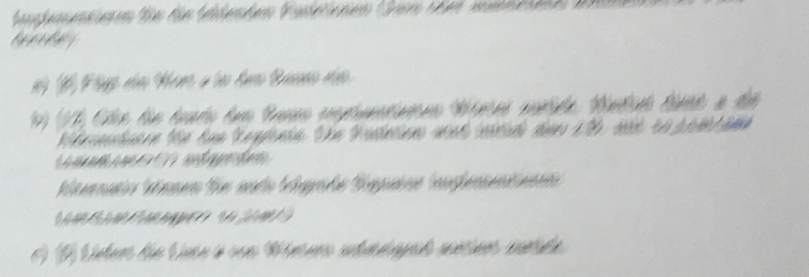

## What is a question?
Questions are the lifeblood of what makes us human. Without questioning the world around us and why things are, would it be any different from what we are today? Some may argue that the ability to question is what makes us human. With the thought provoking hook out of the way, why even worry about making good questions in the first place? "I am curious about something and I need answers now!", some may argue, which can come from a place of genuine curiosity or borderline childish tendencies, but regardless, most of the time, you'll get an answer of the same magnitude. Ask a bad question, get a bad answer, every action has an equal and opposite reaction. This is why it is important to be able to ask smart questions, especially over the internet. On the internet, unless from an online voice chat or video call, people can't read you and the only thing they can do is read you face value. You are doing the same thing with my writing, which I hope you see me in a good light. With all of this in mind, what is an example of a bad question? What is an example of a smart question? The following are scenarios of such questions.

## Bad Question

"HELLO EVERYONE, THIS HOMEWORK PROBLEM IS DUE IN LIKE 2 HOURS AND I ONLY STARTED LIKE 10 MINUTES AGO, I NEED HELP NOWWWWWW!!!!!!" I hope this exemplifies some key aspects of a bad question. One is the lack of being explicit with the question. They were not clear with what exactly is wrong, and the blurry photo was no help either. They essentially posted a plea for help along with pushing on the burden that this person needs the answer now. People get nothing from this, leading to answers like "Good Luck" or "We can't help you" or a whole host of other responses that will not be fruitful for the poster. 

# Smart Question
"Hello everyone, I'm new to programming and I've encountered an error in my code and I'm not sure how to approach it. I'm working in JSFiddle and my problem occurs in my ... function. I want it to do ... but it instead is doing ... . I've tried ... and ... but I seem to be getting errors when trying to run. The type of error is listed as ... and is happening on ... . Here is a link to my fiddle, ..." While not really formatted correctly as I'm not entirely sure about the specifics of a theoretical example program, the example question explains their goal of what they hope to accomplish, describes what they've tried, explicitly stated what the error was, and while not necessary, provided context for the responders which allow them to know what they are getting into. 
