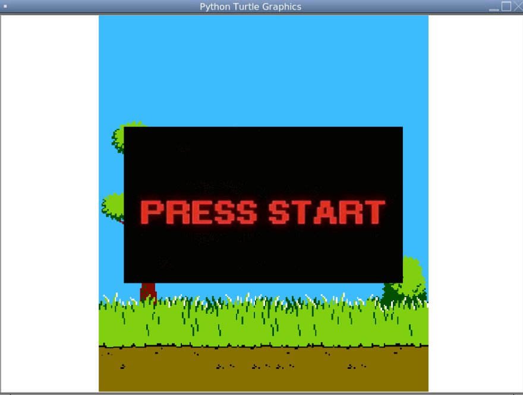

In high school, I took AP Computer Science, which I would say inspired my love for computer science today. As for the final project, we, our group, decided to recreate a simplified version of Duck Hunt. With this, we utilized Python, GUIs and Python Turtles to achieve the effect. 

With this project, I was in charge of the reload function for the blaster in the game. With this experience, I learned about the power of pre-planning a project because there were many hurdles we had to overcome because we did not properly plan everything out. I also learned communication between team members, dividing tasks up, and being there to answer questions whenever one of us had one. Finally, I learned coding standards, in terms of how to write effective code that is readable. We had to overcome this hurdle ourselves because we didn't put too much thought into it, which along with the planning, served as an excellent teaching experience.

Source: <a href="https://replit.com/@PaytonHiga/Test1#main.py"><i class="large github icon "></i>Original Replit Link</a>
