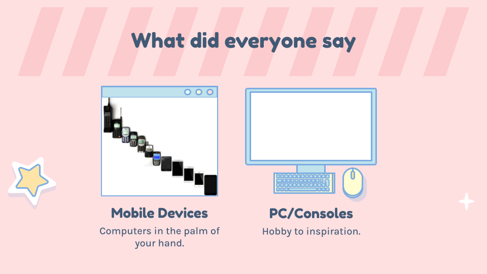

ICS 390 is Computing Ethics for Lab Assistants and is split into a lecture/discussion period and an ATA opportunity in one of the ICS courses here at UH Manoa. The class I'm assigned to help with is ICS 241 which is Discrete Mathematics for Computer Science II. In this class I assist the TA during labs/recitations with worksheets assigned during that period. With this, I'm able to test my presentation skills, trying to demonstrate key concepts for problems during the period. Along with helping other ICS students, it also reinforces my knowledge, meaning a win-win situation. 

As this is a recent endeavour, not much has happened during the lecture periods but it doesn't mean there was not lots of information. From what we have covered so far, we have covered plagiarism and time management skills, which can apply to all of my classes. We also covered public speaking and presentation skills through discussing our favorite public speakers and our fears with presenting. We then covered the catalysts for change in the world with technology, from paper to today's computers. Below is a cutout of my part in the presentation we had to give on the topic.

As not a lot of information is online, here is a link to the entry on the General
Catalog of classes at UH Manoa: <a href="https://manoa.hawaii.edu/catalog/courses/ics-390-computing-ethics-for-lab-assistants-3/"><i class="large github icon "></i>Catalog Link</a>

