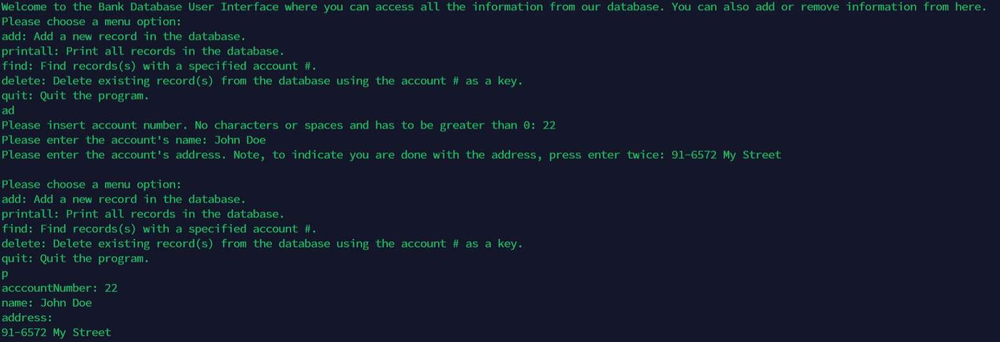

# Overview

Snack Squad was a final project for ICS 314 that dealt with the problem associated with Manoa Munchies. Going around UH Manoa, you may have noticed all of the available restaurants on campus. You have Paradise Palms which has restaurants like Pandas or Dunkin. Near Campus Center you have places like Starbucks or Subway. Remembering all of these locations can get hectic so with Snack Squad, you can see all the restaurants in an organized manner allowing you to search for certain ones. Vendors can add there restaurants to the website with their hours and specials for particular days. Users can search for restaurants, being able to see their general locations along with what specials are available on the day. 

# Some Photos

# Contributions

# What I Learned?

## Collaborators

<ul>
  <li>Dustin Tomi</li>
  <li>Nicolas Steger</li>
  <li>Raymond Lai</li>
</ul>

Source: <a href="https://snack-squad.github.io/"><i class="large github icon "></i>Link to the Github organization page</a>
