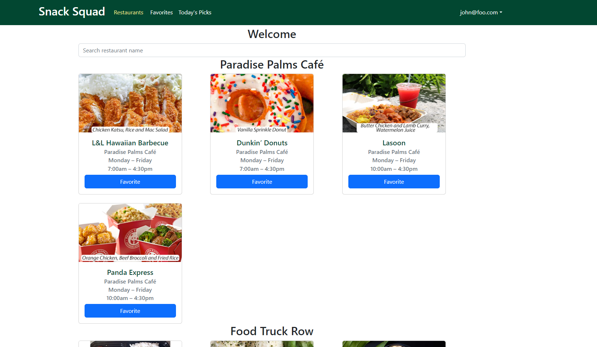

# Overview

Snack Squad was a final group project for ICS 314 that dealt with the problem associated with Manoa Munchies, worked on by myself along with Dustin Tomi, Nicolas Steger, and Raymond Lai. Going around UH Manoa, you may have noticed all of the available restaurants on campus. You have Paradise Palms which has restaurants like Pandas or Dunkin. Near Campus Center you have places like Starbucks or Subway. Remembering all of these locations can get hectic so with Snack Squad, you can see all the restaurants in an organized manner allowing you to search for certain ones. Vendors can add there restaurants to the website with their hours and specials for particular days. Users can search for restaurants, being able to see their general locations along with what specials are available on the day. 

# Some Photos of the Live Website

# Contributions

Like a lot of my teammates, we worked together on a lot of pages. One person had a problem, one of us came to help so each of us have some sort of impact on each page and aspect of the website. My bigger contributions dealt with the Admin side of the websites with bits and piece on the user end with the restaurant display and sorting function. Along with those, I also had a part to play in the database dealing with the restaurants. 

# What I Learned?

This project was fun and changed how I see teamwork as a whole. I felt I could have contributed more to the group and I learned how much more work goes into working on an application on a team setting. Overall, being our first project on this scale, I felt we did good for what we had at the time. 

## Collaborators

<ul>
  <li>Dustin Tomi</li>
  <li>Nicolas Steger</li>
  <li>Raymond Lai</li>
</ul>

Source: <a href="https://snack-squad.github.io/"><i class="large github icon "></i>Link to the Github organization page</a>
